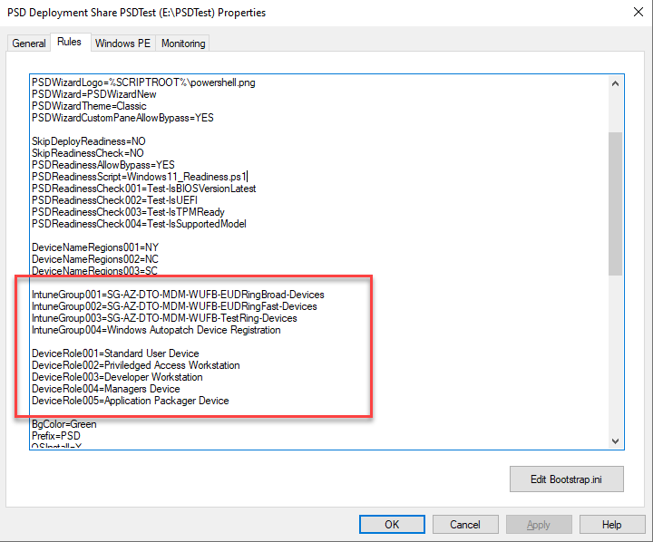
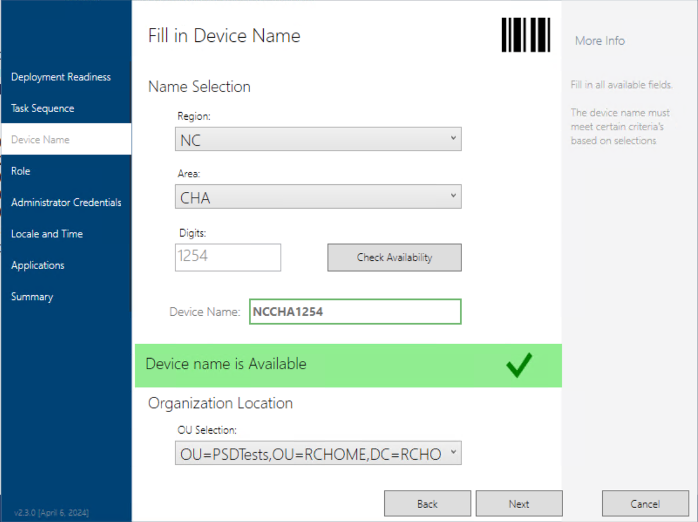
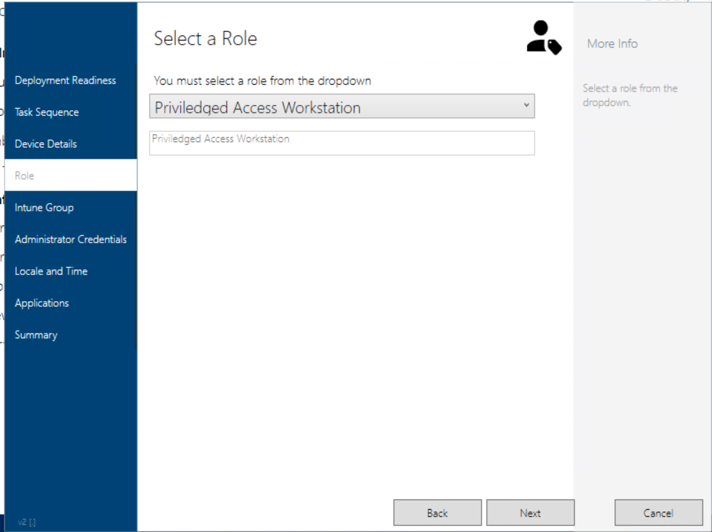
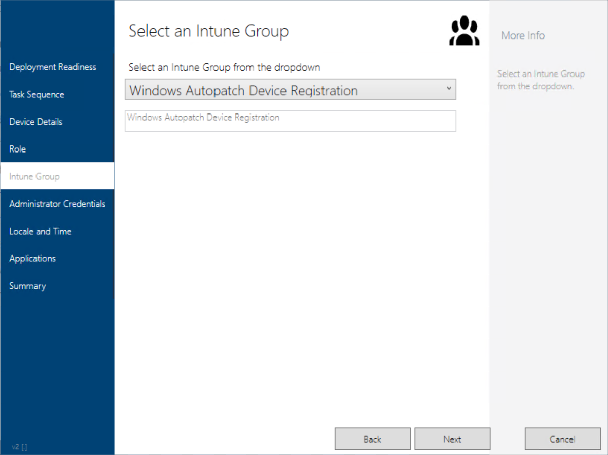
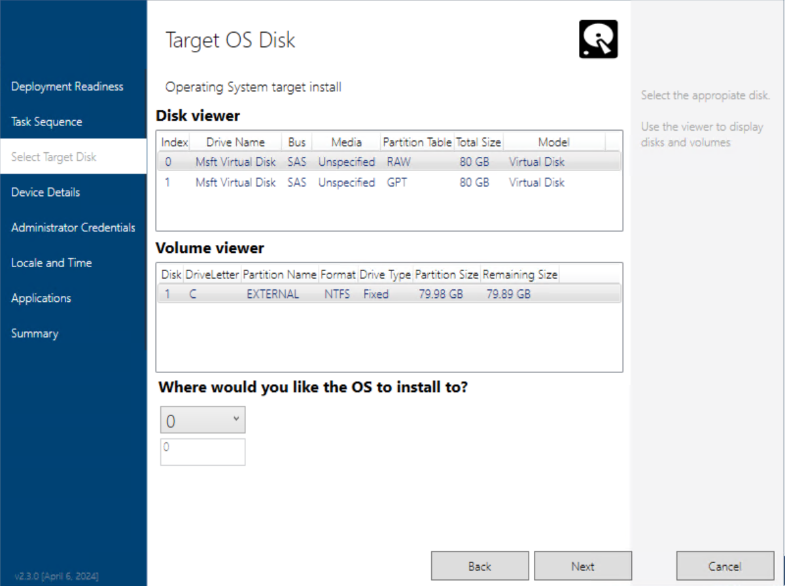
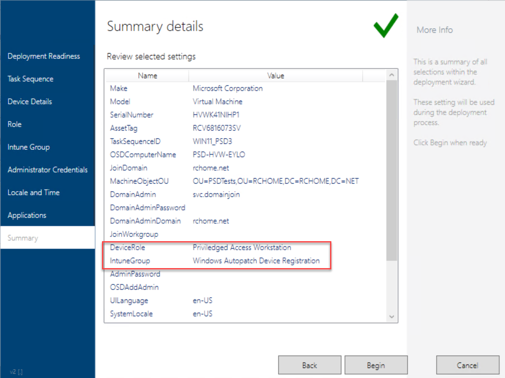

# PSDWizardNew Custom Page 

How to create custom pages for PSD

- Samples included

> NOTE: Current PSDWizardNew module does not include the ability to call custom scripts for custom pages. Custom Pages can still be added but the data will need to be populated within the xaml page itself. The next release (v2.3.0.+) will allow for custom scripts

## Dependencies

- Latest [PSD](https://github.com/FriendsOfMDT/PSD) installed

## Custom Scripts requirements

- Script must be placed in the CustomScripts folder of the PSDResources module
- Script must be named PSDWizard_<CustomPaneName>.ps1. One script per custom page
- Script must contain a $PageLoadScriptBlock and $PreloadScriptBlock. These can be empty scriptblocks
- Script can contain other functions and variables as needed outside the scriptblocks. However keep in mind this will be processed twice. 


## How to add a page

1. Open the definition file for a theme (eg. \<PSD>\Script\PSDWizardNew\Themes\Classic_Theme_Definitions_en-US.xml) in a Text editor

2. Add a new pane line with page details 

```xml
<Pane id="CustomPane_GroupPage" reference="Classic\PSDWizard_GroupPage_en-US.xaml" margin="0,0,0,0" />).
```
> NOTE: The list order DOES matter; it controls where the page will be

3. Add a new xaml file in the \<themes> folder and name it the same as the reference. In this example I would add a new file here:  <PSD>\Script\PSDWizardNew\Themes\Classic\PSDWizard_GroupPage_en-US.xaml.


4. Edit the page. It must consist of these elements (expect what's in bold). Be sure give the name of the tab something unique (eg. x:Name="_grpTabLayout")

```xml
<Grid x:Name="_grpTabLayout" Margin="0" Grid.ColumnSpan="2">
    <Grid.ColumnDefinitions>
        <ColumnDefinition Width="490"></ColumnDefinition>
        <ColumnDefinition Width="150"></ColumnDefinition>
    </Grid.ColumnDefinitions>
    <Label x:Name="_grpTabMainTitle" Grid.Column="0" HorizontalAlignment="Left" Margin="10,20,0,0" VerticalAlignment="Top" FontSize="22" Content="@MainTitle"/>
    <Label x:Name="_grpTabSubTitle" FontSize="14" HorizontalAlignment="Left" Margin="10,73,0,0" VerticalAlignment="Top" Content="@SubTitle"/>

    <TextBox x:Name="TS_IntuneGroup" HorizontalAlignment="Left" Height="31" Margin="10,103,0,0" VerticalAlignment="Top" Width="331" Foreground='Gray' FontSize="18"/>

    <Label Content="More Info" Grid.Column="1" FontSize="14" HorizontalAlignment="Left" Margin="10,31,0,0" VerticalAlignment="Top" Foreground="LightSlateGray" />
    <TextBlock x:Name="_grpTabMoreInfo" Grid.Column="1" HorizontalAlignment="Left" Margin="10,89,0,0" Width="136" TextWrapping="Wrap" VerticalAlignment="Top" Height="422">
        <Run Text="@Help"/>
    </TextBlock>
</Grid>
```


5. Within the grid you can add code to make inputs, dropdowns, buttons, etc. The problem is this code HAS to be formatted correctly or the whole wizard won't load! I like to take code from other pages as an example. If you do this any x:Name MUST be unique and by setting one of the x:Name with a TS_\<value>; will be exported as a variable when wizard is closed.

> HINT: Knowing the margins can be tricky; either use Visual Studio 2022 Community Edition to edit the xaml or copy code from another page of the same property. I copied the search input box from the application page and removed some properties. In this screenshot there is a section to build a two column page (help menu is in Column 1)
Follow these steps for a quick way to get your VS project setup: https://github.com/PowerShellCrack/PSDWizardNew_CustomPages/blob/main/Samples/README.MD


Here is what it looks like in VS2022


> The last thing to do is control how the page will display and what language. You'll notice in the VS2020 Screenshot, some text with @ in the. These are placeholders for words in a language. Even though English is the only supported language right now, this definition contains all types of pages and their conditions.

6. Open the main language definition file (eg. \<PSD>\Script\PSDWizardNew\PSDWizard_Definitions_en-US.xml) in a Text editor
Add a new Pane to where you want the pane to show up (order does matter here). The id must match the name designator of the page (eg. GroupPage is the designator for PSDWizard_GroupPage_en-US.xaml)

```xml
<Pane id="CustomPane_GroupPage" title="Intune Group">
    <Condition><![CDATA[ UCase(Property("SkipGroupPage")) <> "YES"]]></Condition>
    <MainTitle><![CDATA[ "Intune Group" ]]></MainTitle>
    <SubTitle><![CDATA[ "Group Name" ]]></SubTitle>
    <Help><![CDATA[ "Add an Azure AD group.&#xa;&#xa;These setting will be used during the deployment process.
    &#xa;&#xa;Add this device to an Intune group" ]]></Help>
</Pane>
```


> Optional: You can fill in the conditions, Main title, subtitle and help with what you want.
If done correctly you should get this:

7. Set the theme


8. Mount the ISO and boot the device and it should show up:


The ready page will also see the Task sequence variable. This will get exported when wizard complete for additional steps to take action


### Scriptblocks

the PSDWizard checks for any page that has the prefix id of _CustomPage\__; it will then check for a corresponding script and attempt to run it. 

Each page script is processed twice, once in the Preload phase (BEFORE PSDWIZARD LOADS) and once in the PageLoad phase (WHEN PAGE IS ACTIVE), there should be careful planning on which scriptblock will processes what. 

- **PreloadScriptBlock** - Used to define functions and variables that will be process BEFORE the Wizard is loaded
  - Useful for defining event handlers and other functions that need to be defined before the Wizard pages are loaded
  - Useful to process large amounts of data or latency data that will be used in the Wizard (This could increase the time it takes the wizard to display)

- **PageLoadScriptBlock** - Used to define the actions that will be taken AFTER the Wizard is loaded and each time the Pane ise displayed
  - Keep this scriptblock light as it is processed each time the page is loaded and cen effect performance.
    - If event handlers are in this scriptblock, it will run the entire script for every event triggered
  - Useful for setting the initial state of the Wizard elements
  - Useful for setting the initial values of the Wizard elements
  - Useful for setting the initial visibility of the Wizard elements
  - Useful for checking logic of the Wizard elements

### Useful Functions

Theses are useful functions you can use to interact with the PSDWizard

- **Write-PSDLog** - Used to write log messages to the PSD log
- **Get-PSDWizardElement** - Used to get a reference to a wizard element
- **Set-PSDWizardElement** - Used to set properties of a wizard element
- **Add-PSDWizardComboList** - Used to populate a list of items to a ComboBox (aka dropdown)
- **Add-PSDWizardList** - Used to populate a list of items to a ListBox (eg Modern theme)
- **Get-PSDWizardTSEnvProperty** - Used to get a TSEnv property and value
- **Set-PSDWizardTSEnvProperty** - Used to set a TSEnv property value
- **Get-PSDWizardTSData** - Returns Tasksequence steps and OS data
- **Invoke-PSDWizardNotification** - Used to wizard with status messages

## Custom Page steps

For more detail refer to the [PSWWizardGuide](https://github.com/FriendsOfMDT/PSD/blob/master/Documentation/PowerShell%20Deployment%20-%20PSD%20Wizard%20Guide.md)

1. Build the Pages in xaml format (use visual studio and the template file to create new tab items. )
2. Add pane to the Theme definitions file
3. Add context to the PSDwizard Definitions file
4. Create scripts for each page and place them in the CustomScripts. Use this script as a template
5. Use the PreloadScriptBlock to set pre collect data and event handlers of the new elements
6. Use the PageLoadScriptBlock to perform additional action when the page loads

> NOTE. In the PSDWizard XAML code, "Pages" are actually _TabItems_ and often referred to "Panes" instead of "Pages"

## SCRIPT EXAMPLE 1

This is an example of a script that will be used to populate a ComboBox with a list of roles from customsettings.ini

```ini
[Settings]
Priority=Default
Properties=DeviceRole(*)

[Default]    
DeviceRole001=Standard User Device
DeviceRole002=Priviledged Access Workstation
DeviceRole003=Developer Workstation
DeviceRole004=Managers Device
DeviceRole005=Application Packager Device
```

```powershell
$PreloadScriptBlock = {
    #get list from customsettings.ini
    #make the list global so it can be used in the page load script block
    $Global:DeviceRoleList = Get-PSDWizardTSEnvProperty -Name "DeviceRole" -WildCard -ValueOnly
}

$PageLoadScriptBlock = {}

```


## SCRIPT EXAMPLE 2

This is the list of roles in a powershell array


```powershell
#populate list in a global variable
$Global:IntuneGroupList=@(
    "SG-AZ-DTO-MDM-WUFB-EUDRingBroad-Devices",
    "SG-AZ-DTO-MDM-WUFB-EUDRingFast-Devices",
    "SG-AZ-DTO-MDM-WUFB-TestRing-Devices",
    "Windows Autopatch Device Registration"
)

$PreloadScriptBlock = {
    #addd items to list
    Add-PSDWizardComboList -InputObject $Global:IntuneGroupList -ListObject $_cmbIntuneGroup
}

$PageLoadScriptBlock = {}
```

## SAMPLES

In the repo I have provided some sample pages. Each of these samples has a set of file that will need to be added or modified to the existing PSD Deployment Share.

- **TargetDisk** - A wizard page that allows you to choose the disk to target OS deployment. 
- **IntuneGroup** - A wizard page that displays a drop down that is populated by a list property in cs.ini. There is no mechanism that actually added the device to a group. That would have to be developed
- **Role** - A wizard page that displays a drop down that is populated by a list property in cs.ini. This value can then be used later on in Task sequence to do additional actions (Not included)
- **DeviceName** - A wizard page that shows multiple dropdowns to generate proper device name. Then there is a check availability button that will attempt to check the name against AD. **This is NOT 100 working yet**. This requires the [adsi in PE](https://www.deploymentresearch.com/adding-adsi-support-for-winpe-10/) as well
- **IntuneCategory** - COMING SOON
- **AutopilotProfile** - COMING SOON

## How to Apply Samples

> WARNING READ THOROUGHLY: DO NOT JUST OVERWRITE. You can break the wizard

|FileName|Themes Supported|Explanation|Action|
|--|--|--|--|
|**CustomSettings.ini**|N/A|Used to specify theme and potentially data for page| EDIT current _Control\CustomSettings.ini_ file with these properties
|**Classic_Theme_Definitions_en-US.xml**|Classic|This file controls what order the page shows up in the wizard | EDIT the _Scripts\PSDWizardNew\Themes\Classic\Classic_Theme_Definitions_en-US.xml_ file and add pane to the list. Follow the example in file. The Id MUST begin **CustomPane_**.
|**PSDWizard_Definitions_en-US.xml**|Classic|You must define the id of the page (use same pane id in theme definition file), the name (friendly name), and what conditions are for it. You can use custom properties for conditions, just be sure to specify them in the cs.ini |
|**PSDWizard_<CustomPane>.ps1**|N/A| Script must be placed in the CustomScripts folder of the _PSDResources_ folder. The name must start with **PSDWizard_**, then the name of the pane specified id in the definitions xml file|Place this file in _PSDResources\CustomScripts_. Boot image does not need to be updated| 
|**PSDWizard_<CustomPane>_en-US.xaml**|Classic,Refresh|This is the pane that shows in the wizard. Recommend using Visual studio to modify|Add this file to the _Scripts\PSDWizardNew\Themes\Classic_ folder
|**Icons.xaml**|All|These are SVG icons used in the custom pane| EDIT the _Scripts\PSDWizardNew\Resources\Icons.xaml_ file and add the canvas item|

## Sample Screenshots














## Limitations

These samples currently written for the classic theme, however these can be modified to support additional PSDWizard themes. Request using issues

## Want More?

I can develop more pages upon requests. Just post them in the issue tracker on details you would like to see.