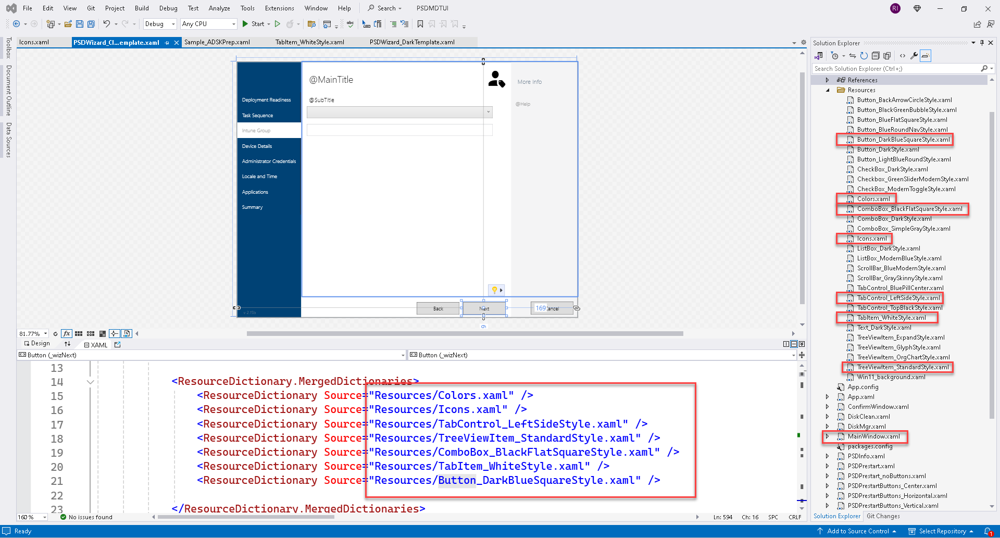

# Edit pages using Visual Studio 2022

To use the PSDWizardNew_Classic_VS2022_Template.xaml in Visual Studio 2022

1. Create a new project
2. Copy contents _PSDWizardNew_Classic_VS2022_Template.xaml_ to MainWindow.xaml in project
3. Create a _Resources_ folder
4. Copy resource xaml highlighted. You can find these in the PSD deployment share under _Scripts\PSDwizardNew\Resources_ folder
5. You may need to right click the _Resources_ folder --> Add exiting item in VS designer

